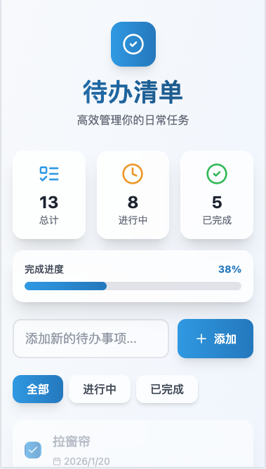
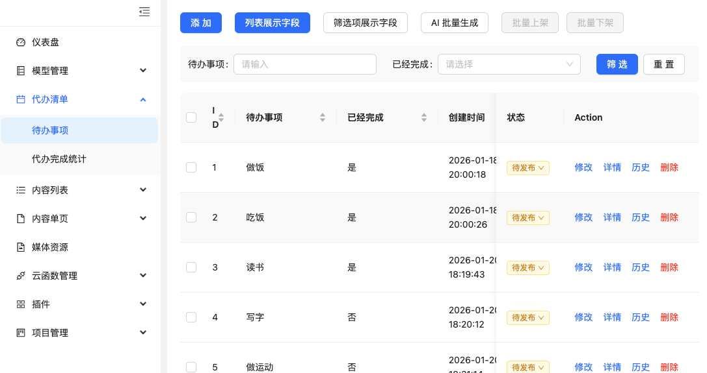
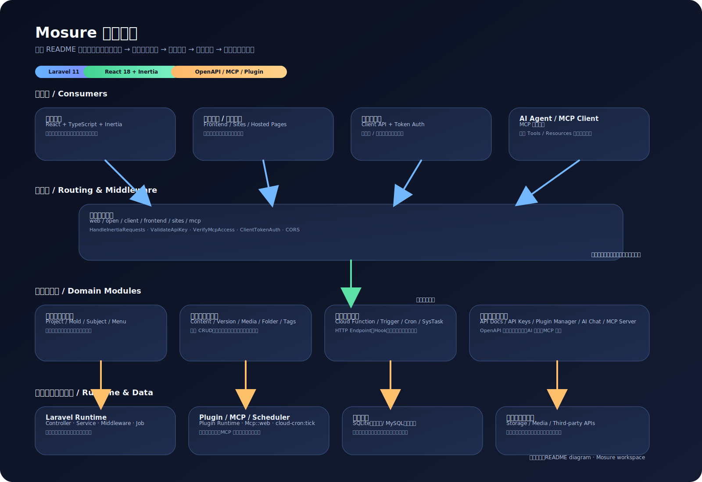
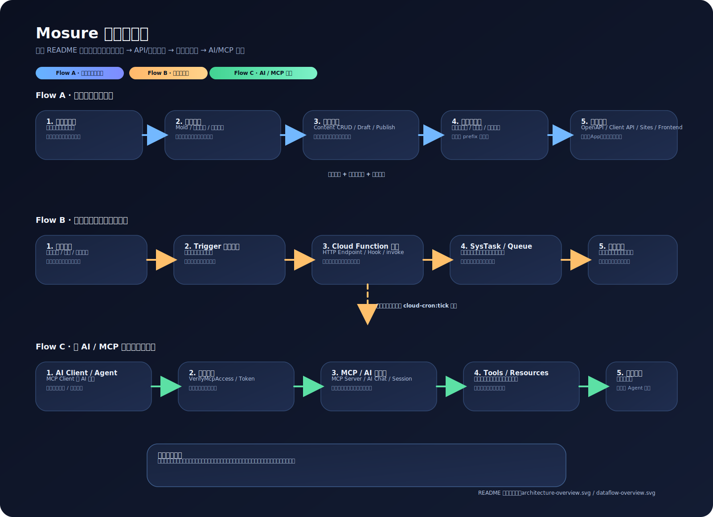

# Mosure / 模枢

> 用一个后台，管理内容、输出接口、驱动自动化、连接 AI。  
> Mosure 面向个人开发者、小团队与私有部署场景，适合用来搭建内容后台、知识库、官网数据中心、应用后端和 AI 数据底座。

Mosure 把这些能力放进了同一个系统里：

- **内容建模**：可视化定义内容结构与字段
- **内容管理**：录入、发布、版本、回滚、媒体管理
- **API 输出**：自动生成 OpenAPI，供网站、App、小程序、插件前端调用
- **自动化工作流**：云函数、触发器、定时任务、异步任务中心
- **AI 集成**：AI 辅助建模、AI 内容生成、MCP Server
- **扩展能力**：插件系统、页面托管、项目级隔离

---

## 你可以用 Mosure 做什么

### 1. 搭建企业官网 / 品牌站内容后台
管理公司介绍、服务、案例、团队、新闻、FAQ、联系表单等内容，并对外提供页面或接口。

### 2. 搭建知识库 / 帮助中心 / FAQ 中台
统一沉淀流程规范、产品资料、术语库、知识条目，并让官网、客服系统或 AI 助手共同使用。

### 3. 作为小型应用的后端
通过内容模型 + OpenAPI，快速为 Todo、资料库、收藏夹、内容站、内部工具等应用提供数据能力。

### 4. 做内容自动化工作流
当内容创建、更新或发布后，自动触发函数执行同步、通知、分发、归档等流程。

### 5. 作为 AI / Agent 的数据底座
通过 MCP Server 与结构化内容模型，为 AI 助手、Agent、问答系统提供可控、可维护的数据来源。

### 6. 通过插件快速安装模板能力
项目内置插件机制，适合沉淀通用模型、函数、菜单与前端模板，支持重复安装与复用。

---

## 典型场景

### 内容中心
- 文章、教程、案例、产品资料、术语、FAQ 统一管理
- 一份内容，多处复用

### 企业官网
- 服务介绍、案例展示、团队成员、新闻动态、联系留言
- 可配合页面托管或前端项目使用

### 小型业务系统
- 用内容模型快速搭出管理后台
- 再通过 OpenAPI 提供给 Web、移动端或内部工具

### AI 内容工作流
- AI 生成内容
- 触发器识别事件
- 云函数调用第三方平台
- 任务中心跟踪执行状态

### 知识型应用
- 把知识条目、分类、标签、文档与结构化内容统一存储
- 再输出给 AI 问答、知识检索或内容分发场景

---

## 核心能力

### 内容建模
- 可视化创建内容模型与字段
- 支持 20 种字段类型
- 支持 AI 辅助生成表单结构
- 支持项目隔离的数据组织方式

### 内容管理
- 内容 CRUD
- 草稿 / 发布状态
- 版本记录、对比、回滚
- 单页与列表型内容管理

### 媒体资源管理
- 文件上传
- 文件夹管理
- 标签管理
- 批量操作

### API 与对外输出
- OpenAPI 自动生成
- API Key 鉴权
- Open API（`/open/*`）
- Client API（`/client/*`）
- 页面托管与前端页面访问

### 自动化能力
- Web 函数（HTTP Endpoint）
- Hook 函数
- Triggers 规则编排
- Cron 定时任务
- 异步任务中心

### AI 与扩展
- AI 辅助建模
- AI 内容生成
- AI 会话与 Agent 能力
- MCP Server
- 插件系统

---

## 开箱示例

当前仓库已经包含一些可直接参考的模板与插件：

- **企业官网模板**：`Plugins/companysite`
- **Blog 模板**：`Plugins/blog`
- **TodoList 示例**：`Plugins/todolist`

### TodoList 示例界面




---

## 架构总览

Mosure 的整体结构可以概括为：

> 多种访问入口 → 路由与鉴权 → 领域服务 → 插件 / MCP / 调度 → 数据与外部系统



---

## 数据流转图

Mosure 的核心链路可以概括为：

> 建模与录入 → 数据持久化 → API / 页面输出 → 自动化执行 → AI / MCP 消费



---

## 技术栈

- **后端**：PHP 8.2+, Laravel 11.x
- **前端**：React 18, TypeScript, Vite, Inertia.js
- **UI**：Ant Design
- **数据库**：SQLite（开发）/ MySQL（生产）
- **队列**：database / sync
- **缓存**：file / database

---

## 快速开始

### 环境要求

- PHP >= 8.2
- Composer
- Node.js >= 18
- npm >= 9

### 本地安装

```bash
git clone https://gitee.com/gibson_0822/mosure.git
cd mosure

# Linux / macOS
./bin/install.sh

# Windows
bin\install.bat
```

默认行为：

- 本地默认使用 SQLite
- 可直接使用 `php artisan serve`
- 不依赖 Redis 才能启动本地开发环境
- 安装器会自动检查必要目录与写权限

也可以手动执行：

```bash
composer install
php artisan mosure:install --name=Admin --email=admin@example.com --password=<your-password>
```

### 启动开发环境

**macOS / Linux**

```bash
./bin/start.sh
```

**Windows**

```cmd
bin/start.bat
```

或手动启动：

```bash
php artisan serve --host=0.0.0.0 --port=9445
php artisan queue:work
```

### 访问地址

- 管理后台：`http://127.0.0.1:9445`
- 安装向导：`http://127.0.0.1:9445/install`

---

## 3 分钟体验闭环

1. 创建一个项目
2. 新建一个内容模型，例如 `article`
3. 添加几条内容
4. 创建 API Key
5. 调用 Open API 获取列表数据

示例：

```bash
curl -X GET "http://127.0.0.1:9445/open/blog/content/list/article" \
  -H "X-API-Key: your_api_key_here"
```

你也可以进一步：

- 配置云函数做业务接口
- 配置触发器处理内容变更事件
- 配置定时任务做定时同步
- 通过 MCP 接入 AI Agent

---

## 最佳实践

- **一个项目聚焦一个业务域**  
  例如官网、知识库、博客、工具应用尽量分开管理

- **先建模型，再录内容**  
  先把字段结构定义清楚，后续接口与自动化会更稳定

- **项目前缀尽量一次确定**  
  `prefix` 会参与项目隔离、接口路径和数据命名

- **API Key 使用最小权限原则**

- **触发器负责规则，云函数负责逻辑**  
  这样更容易维护与复用

- **生产环境建议使用 MySQL + 独立 Queue Worker**

- **将可重复能力沉淀为插件**  
  比如模板模型、前端模板、函数组合、菜单结构

---

## 文档导航

详细文档请查看 [docs/](docs/)：

- **[入门指南](docs/2.入门指南/)**：安装、配置、快速开始、目录结构
- **[核心能力](docs/3.核心能力/)**：表单与字段系统、AI、MCP、OpenAPI、任务化能力
- **[基础功能](docs/4.基础功能/)**：项目、内容、媒体、函数、触发器、任务中心等
- **[开发者指南](docs/5.开发者指南/)**：架构、插件开发、本地开发、测试与质量
- **[附录](docs/6.附录/)**：FAQ、术语表

---

## 常用命令

```bash
# 启动开发环境
bin/start.sh

# 一键安装
php artisan mosure:install

# 创建插件
bin/create-plugin.sh

# 生成格式化 plugin.json
bin/generate-plugin-json.sh
```

---

## 贡献

欢迎贡献代码、报告问题或提出建议。  
详见 [贡献指南](docs/1.前言/03-贡献指南.md)。

---

## 许可证

MIT License

---

## 联系方式

- Gitee Issues：[提交问题](https://gitee.com/gibson_0822/mosure/issues)
- 文档入口：[查看完整文档](docs/)
